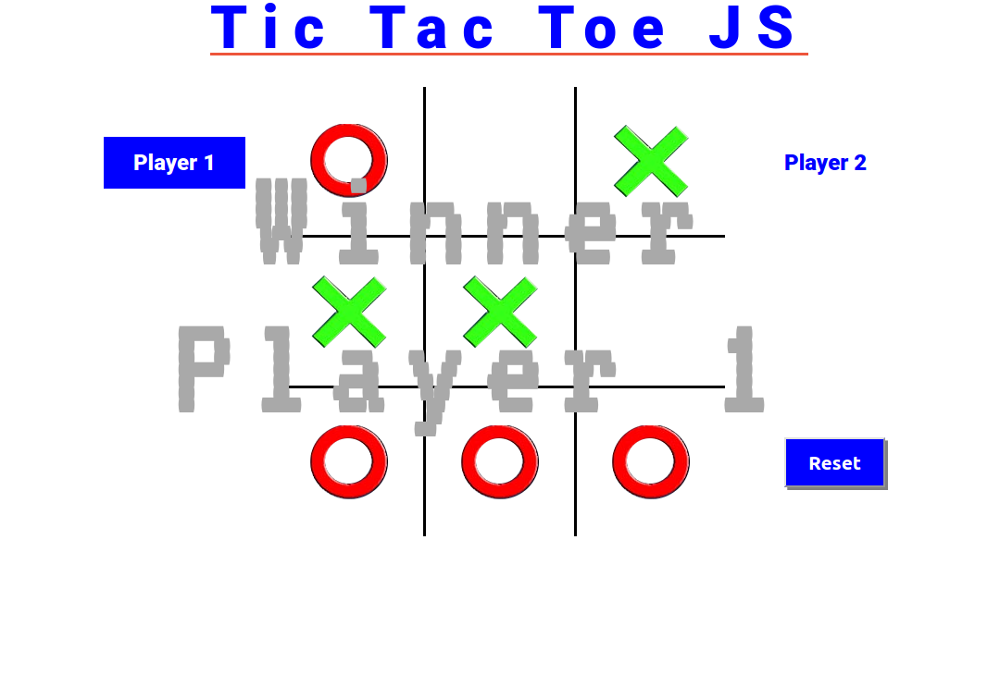

# Tic Tac Toe JS

In this project a Tic Tac Toe game was created (again) but this time it will be shown in the browser. Without backend. In this project the main objective is to put into practice the factory functions and the pattern of the module together with the main concepts of object oriented programming. In particular, classes/objects and how to access their methods and attributes.



## :package: Built With

- Plain HTML5
- Pure CSS3
- Pure Javascript

## :mag: Live Demo

[Live Demo Link](https://mcervantes71.github.io/Tic_Tac_Toe_JS/dist/index.html)

## :computer: Getting Started

To get a local copy up and running follow these simple steps.


### Download

1) Clone the repository to your local machine

```sh
  $ git clone https://github.com/mcervantes71/Tic_Tac_Toe_JS.git
```

2) cd into the directory

```sh
  $ cd Tic_Tac_Toe_JS
```

### Usage

Install the dependencies in the local node_modules folder

```sh
  $ npm install
```

Bundle JavaScript files for usage in a browser

```sh
  $ npm run bundle
```

Calling the watch method triggers the webpack runner, but then watches for changes

```sh
  $ npm run watch
```

Use webpack with a development server that provides live reloading. This should be used for development only.

```sh
  $ npm start
```

### Testing

```sh
  $ npm run test
```

## :busts_in_silhouette: Authors

👤 **Martin Cervantes**

- Linkedin: [Martin Cervantes](https://www.linkedin.com/in/cervantesmartin/)
- Twitter: [@M4rt1nC3rv4nt3s](https://twitter.com/M4rt1nC3rv4nt3s)
- Github: [@mcervantes71](https://github.com/mcervantes71)
- Gmail: [cervantes.martine](mailto:cervantes.martine@gmail.com)

## 🤝 Contributing

    Contributions, issues and feature requests are welcome!

Feel free to check the [issues page](../../issues).

## :star2: Show your support

    Give a ⭐️ if you like this project!

## 📝 License

This project is [MIT](lic.url) licensed.
